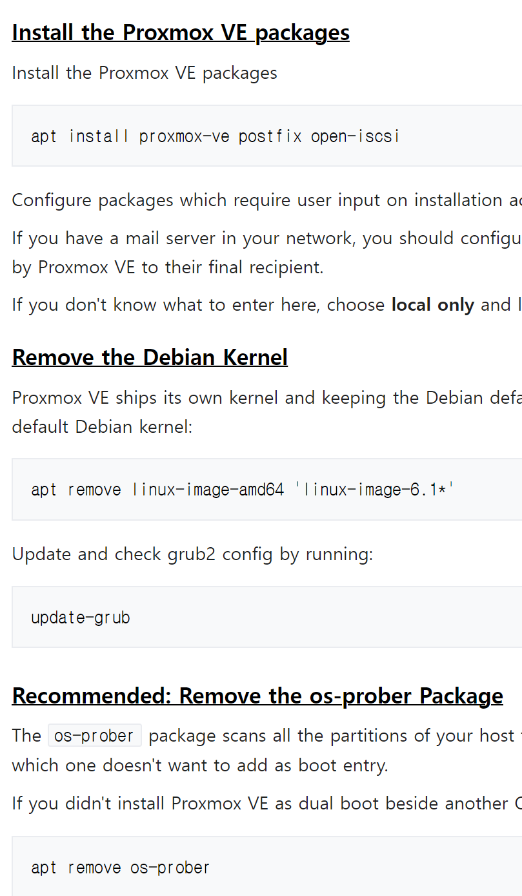
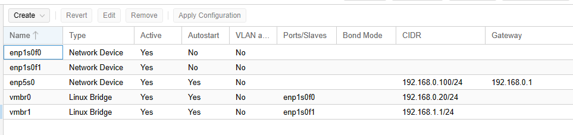

proxmox 7.4 설치 및 VM 올리는 분투기

1. 본 글은 인텔 13세대 (12세대 포함) 시스템을 바탕으로 진행한 proxmox 를 설치하는 방법을 기록한 것으로 추후 삽질을 줄이고 체크해야 할 포인트들을 기록해두는 용도로 만든 글입니다.
2. 현 시점에서 proxmox 8 이 등장했으나, 6.2.x kernel로 설치한 7.4의 경우 쉽게 업그레이드 가능하니 8을 설치할 때에도 사용할 수 있습니다.
3. 뭔지 잘 모르는 상세한 내용은 proxmox wiki 등을 같이 보면 좋습니다. 한글로 적어서 읽기 조금 편하다 + 영알못 (읽기 싫은사람 포함) 을 위한 축약본에 가깝습니다.

* 하드웨어 소개

intel i5 13500

intel B660 

ddr5 64GB

M.2 NVMe disk 1

M.2 based ASM1166 chipset SATA Extension card (알리에서만 파는 물건입니다. 해당 칩셋은 오리코에서 만드는 카드에서도 들어갑니다. )

GT 1030 

intel X550-T2 (pci-e 2.0 x8) 

HDD 5개 

SATA SSD 2개 > 1개는 host (proxmox), 1개는 vm 을 위해 할당

host SSD에서 iso 등을 넣어서 vm 설치를 하는 저장공간으로도 쓸 수 있기 때문에 256GB 정도의 용량이 있으면 좋습니다. 아예 host에 1T를 할당하고 모든 VM의 OS 공간으로 사용하셔도 무방합니다. 

단, proxmox 내에 존재하는 LVM-Thin 을 이용할 수 없는 디스크 이므로 주의해야 합니다. 오직 directory 로만 가능합니다. 

---

wifi -> intel AX211 

wifi 칩셋이 있는 경우 proxmox 페이지에서 제공하는 부팅 파일을 통한 설치가 되지 않고 debian 을 통해 간접적으로 설치하는 것만 가능합니다. 

온보드 wifi 끄는 기능이 없는 상황이 대다수에, 카드를 물리적으로 제거하는 것도 부담스러우므로 반드시 debian 12를 설치해주셔야 합니다. 

---

본 페이지는 위의 wifi 칩셋이 있다는 가정 하에 작성됩니다. 

* requirements

본 글은 윈도우 설치 정도는 그냥 해내는 분들을 기준으로 작성되었으며 만약 장치에 직접적으로 os를 설치하는 baremetal 환경에서의 usb 설치를 하질 않으셨다면 ubuntu / debian  부팅 usb 만들기 등의 과정을 익히는 것을 추천합니다.

또한 ssh, 리눅스 파일시스템, vi 혹은 nano / gedit 등을 사용하여 시스템 파일 수정하는 법을 아는 사람에게 유용합니다. 어느정도의 기본 linux 지식과 영어 게시글에 대한 부담이 적으신 분들을 위한 글(즉, 나) 입니다.

주요 과정 

1. Debian 설치
2. Debian을 통해 proxmox kernel 로 변경
3. proxmox에서 Linux Bridge (vm switch) 설정하기
4. VM 설치
5. xpenology 설치
6. VM 내에서 windows 11 제한사항
7. LVM-thin
8. 총 결과

* Debian 설치

Debian 설치는 12 bookwarm 기준으로 진행하며 아래 웹 사이트를 통해 설정하여 진행할 수 있다. 

[Install Proxmox VE on Debian 12 Bookworm - Proxmox VE](https://pve.proxmox.com/wiki/Install_Proxmox_VE_on_Debian_12_Bookworm)

NIC 가 여러개인 경우, 주 네트워크(가능하면 인터넷 네트워크)에만 설정해두고, 보조 네트워크 혹은 단독 네트워크도 등록하는 것은 지양해주는 편이 좋습니다. 추후 linux bridge 설정할 때에 보조 네트워크를 쉽게 물려야 하는데, 보조 네트워크에 장치가 등록되어 있으면 끄고 네트워크 서비스 다시 설정하고 터미널 다시 설정하는 등의 삽질이 들어갑니다. 

update 등을 진행하기 위해 인터넷 연결을 필요로 합니다. 

* Debian을 통해 proxmox kernel 로 변경

recommended는 os 선택지를 grub 내에서 남겨놓는걸 없애버리는 걸 의미하므로, 그냥 해주셔야 합니다. 

proxmox를 host로 설정할 정도면 리눅스 멀티부팅을 할 이유는 없을테니

참고: wifi 드라이버가 proxmox 패키지에 설치되어 있지 않으므로, wired nic(랜카드)를 사용해서 연결하거나 별도의 작업을 진행하여 wifi 드라이버를 통해 proxmox를 실행할 수 있도록 해야 합니다.

* proxmox에서 Linux Bridge (vm switch) 설정하기

Proxmox VE 를 installation file로 설치한 경우 기본 NIC를 자동으로 bridge로 설정하여 연결합니다. 다만 debian을 통한 설치는 자동으로 설정되지 않으므로, nic를 bridge를 설정해주셔야 합니다.

예시> 

3nic (2개는 메인 망, 1개는 10G 망-pc 간 direct connection) 

주의사항: 설정에 실패하는 경우 웹 접근이 어려워지고 저 gui 설정을 이제 cli로 pc에서 설정해야 합니다. 

당연히 물리적 접근이 안되면 매우 곤란한 상황에 처해질 수 있습니다.

* pci express 할당

* VM 설치
* xpenology 설치
* VM 내에서 windows 11 제한사항
* LVM-thin
* 총 결과
